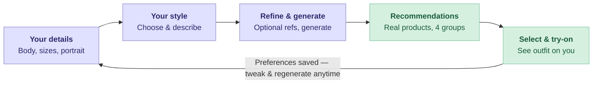

# AI-Powered Virtual Outfit Try-On

[Demo](https://drive.google.com/file/d/12WYQsrZuvHHgJNhL23ISnLeXpnLddCCN/view)
[Presentation](AI-Powered-Virtual-Outfit-Try-On.pdf)

As part of our Human-AI interaction class, we were tasked to design an AI-enabled interactive system, for a problem of our choice, focusing on the importance of the interaction between AI and people in technology. As such, a proof-of-concept prototype demonstrating the core interaction was requested.
 

According to a 2011 study, website quality significantly impacts user trust and perceived utility, indicating that more advanced and informative interfaces can reduce the risks associated with online shopping. Additionally, user experience is the most influential factor in determining whether a user will continue using the system.

This project, as a prototype, aims to tackle both of these issues through a user friendly, intuitive interface, offering automated inference of their fashion style whilst providing diverse outfit selection.


## Requirements

Node.js (v18+ for Next.js 15) for the frontend. Dependencies must be installed in the root directory beforehand through ```npm install```. Running the frontend is done through ```npm run dev```, also in the root folder. 

A Gemini API key for ```gemini-2.5-flash``` and a Serp API key, in the ```.env``` file.

CatVTON virtual try-on diffusion model (installation instructions can be found here https://github.com/Zheng-Chong/CatVTON). Conda is recommended for the installation (https://www.anaconda.com/docs/getting-started/concepts/anaconda-or-miniconda). The installed folder must be present alongside the project folder to run correctly. The steps to run the model locally are as follows:

1. ```conda activate catvton``` (Optional, only if using conda virtual environments)
2. ```cd [your CatVTON directory]```
3. ```python -m uvicorn vton_service:app --host 127.0.0.1 --port 8500```

Optional but recommended: Nvidia GPU (GTX 1050 or higher) to run the local model efficiently.

## Usage



A user may provide their physical characteristics and portrait or start off from one of many available presets, based on notable online figures. They should then provide their desired top size, waist size and foot size.

In the next step, users are given the option to select their style amongst 6 different varieties, describe their style freely in text, or both.

Up to two additional inspiration images may be uploaded to improve personalization. Afterwards, a detailed, textual overview of their inferred style can be generated and provided to the user, alongside a variety of items according to their stated preferences. Interacting with the images of these items will automatically redirect the user to the respective retailer. They may also be selected for a modeled preview based on the user portrait, which can be done through the generate button. Footwear is exempt from this process.

## Components

The web application is composed of several different components, detailed in this section. The following diagram describes the current system architecture:


#### Frontend

The frontend is a single-page Next.js 15 / React app (TypeScript, Tailwind CSS, Framer Motion animations) centered on a client-side StyleForm three-step wizard, with a parent page that holds shared state and renders the results. State and returning-user persistence are handled entirely client-side. UI communicates to the backend solely through ```fetch``` calls.

#### Backend

The backend is a thin orchestration layer of Next.js API routes: upload, style-description, search-clothes, and generate-preview, holding the secret keys and proxy requests to each external service (Google Gemini for the style profile, SerpAPI for product search). Per-provider logic is factored into ```lib/``` modules. A separate self-hosted Python FastAPI service wraps the CatVTON model for GPU-based virtual try-on. There is no database, persistence is handled entirely client-side via localStorage.

#### Gemini Instance

The Gemini integration is a single stateless call to the ```gemini-2.5-flash``` API (via ```styleDescription.ts```) that receives the portrait, reference photos, and the user's data. It is responsible for returning a JSON style profile plus the four hidden shopping queries to be sent to the web scraper. No conversation memory or context is carried between calls.

#### SerpAPI (Web Scraper)

SerpAPI is a stateless call to its Google Shopping engine (via ```clothingSearch.ts```) that receives the four AI-generated category queries suffixed with the user's clothing sizes, returning real shoppable products, which are then de-duplicated and ranked by a review-weighted (Bayesian) rating before display.

#### CatVTON

The CatVTON integration serves as a free alternative to expensive LLM calls for try-on generation. A call is made to a self-hosted Python FastAPI service (via ```avatarGeneration.ts```) that receives the portrait plus the selected garment images and runs two sequential passes. Upper (outerwear or top) then lower (bottom) — to return a single front-view try-on image. Side view is left unused, see Limitations section.

## Data Processing and Storage

All the data given by the user is cached locally in the browser's localStorage. This allows the user to skip the first phase of the application entirely for repeated interactions. In an ideal production environment, a dedicated database would be used instead.

Physical characteristics, selected style and style description are provided to a Gemini LLM instance (```gemini-2.5-flash```) for the generation of the full, inferred style description. The desired size of each garment is used directly for the SerpAPI web scraper.

## Limitations

Results from the try-on model are often underwhelming. Given that this is simply a prototype, this issue is tolerated.

The generated side preview is unused due to limitations within CatVTON. In a production environment, both front and side profiles would be generated through an API call to the existing Gemini integration (under a different model) or separate LLM, greatly reducing the time and load for try-on generation.

## User Study

A user study was conducted to evaluate the application through the means specified in [1], [2] and [3]. This study surveyed 18 respondents (17 on one item) across eleven measures spanning transparency, relevance, fairness, privacy, feedback, and overall satisfaction. Respondents answered each item on a 1–5 rating scale or a yes/no/maybe choice. Ratings were mapped linearly from 1=0% to 5=100%, and choices were mapped no/maybe/yes to 0/50/100%. Each percentage is the average across all respondents for that item.

| Category | Measure | Score |
|---|---|---|
| Relevance | Provided task and context-relevant information | 74% |
| Fairness | Perceived as appropriate and free of bias | 89% |
| Privacy | Users felt free of privacy invasion | 78% |
| Feedback | Easy to give the AI preferences during use | 83% |
| Transparency | Made clear what it could and couldn't do | 64% |
| Transparency | Access to explanations for its behaviour | 58% |
| Transparency | Awareness of how often the AI errors | 38% |
| Satisfaction | Result matched expectations | 58% |
| Satisfaction | Results were what users wanted | 64% |
| Loyalty | Would return to the website | 61% |
| Loyalty | Would recommend to others | 56% |

Overall, the prototype demonstrated a solid, well-optimized human-AI interaction. Its strengths were fairness, feedback, privacy, and task relevance, while satisfaction and loyalty were moderately positive. The clearest weak point was transparency around the AI's limitations, especially users' awareness of how often it might make errors. This is to be expected given the unpredictability of CatVTON with specific garments.

## References

[1] Amershi, S., Weld, D., Vorvoreanu, M., Fourney, A., Nushi, B., Collisson, P., … Horvitz, E. (2019). Guidelines for Human-AI Interaction. Proceedings of the 2019 CHI Conference on Human Factors in Computing Systems, 1–13. Presented at the Glasgow, Scotland Uk. doi:10.1145/3290605.3300233

[2] Ji, M., Genchev, G. Z., Huang, H., Xu, T., Lu, H., & Yu, G. (2021). Evaluation framework for successful artificial intelligence–enabled clinical decision support systems: mixed methods study. Journal of medical Internet research, 23(6), e25929.

[3] Reddy, S., Rogers, W., Makinen, V. P., Coiera, E., Brown, P., Wenzel, M., ... & Kelly, B. (2021). Evaluation framework to guide implementation of AI systems into healthcare settings. BMJ health & care informatics, 28(1), e100444.